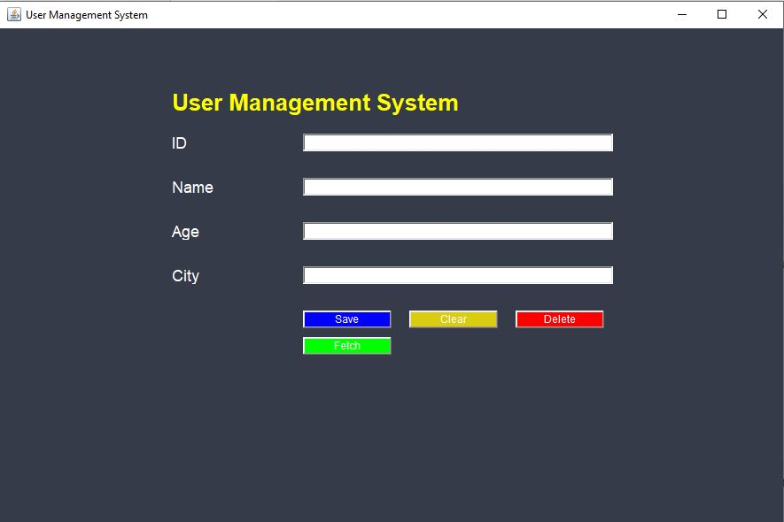

# AWT User Management System

A Java desktop application for managing user data using a graphical user interface (GUI) built with **AWT** (Abstract Window Toolkit). This application allows users to perform basic CRUD (Create, Read, Update, Delete) operations on a MySQL database.

## Features

- **Add User**: Add new user data (name, age, city) into the database.
- **Fetch User**: Retrieve user data by ID from the database.
- **Update User**: Update existing user information by ID.
- **Delete User**: Remove a user’s record by ID.
- **Clear Fields**: Clear all input fields in the form.

## Technologies Used

- **Java AWT**: For creating the GUI.
- **MySQL**: As the database to store user information.
- **JDBC**: For connecting Java application with MySQL.
- **IntelliJ IDEA**: IDE used for development.

## Prerequisites

Before you begin, ensure you have met the following requirements:

- Java Development Kit (JDK) 8 or higher installed.
- MySQL database installed and running.
- MySQL JDBC Driver (Connector/J) added to your project classpath.
- IntelliJ IDEA (or any Java IDE) installed for running the project.

## Database Setup

1. Open your MySQL client and run the following commands to create the database and table:

    ```sql
    CREATE DATABASE crud;
    USE crud;

    CREATE TABLE User (
      ID INT PRIMARY KEY AUTO_INCREMENT,
      Name VARCHAR(100),
      Age INT,
      City VARCHAR(100)
    );
    ```

2. Ensure MySQL is running on `localhost:3306` with the username `root` and no password, or modify the connection settings in the Java code accordingly.

## Installation

1. Clone this repository:

    ```bash
    git clone https://github.com/your-username/AWT-User-Management-System.git
    ```

2. Open the project in IntelliJ IDEA (or your preferred Java IDE).

3. Add the MySQL JDBC driver to your project’s classpath:
   - Download the JDBC driver from [here](https://dev.mysql.com/downloads/connector/j/).
   - Add the `.jar` file to the project’s libraries.

4. Update the database connection credentials if needed in the `connect()` method inside the `User.java` class:

    ```java
    String url = "jdbc:mysql://localhost:3306/crud";
    String userName = "root";
    String password = ""; // Enter your MySQL password if applicable
    ```

## Usage

1. Run the `User.java` file.
2. The User Management System GUI will launch.
3. Use the form to add, update, delete, or fetch user details from the database.

### Actions:
- **Save**: Insert or update user information in the database.
- **Fetch**: Retrieve user information by entering the user ID.
- **Delete**: Delete the user by ID.
- **Clear**: Clear all text fields.

## Project Preview

Here's a preview of the User Management System:




## Future Enhancements

- Implement input validation to prevent invalid data entry.
- Add more fields to the user (e.g., email, phone number).
- Implement search functionality by other criteria (e.g., name, city).
- Improve the user interface with more advanced layout management.

